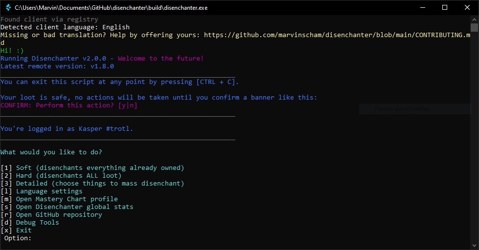

  

<h1 align="center">Disenchanter</h1>

Mass disenchant LoL loot like champion shards, eternals, mythic essence and more!

## Usage
Download the pre-built `disenchanter.exe` from the [Latest Release](https://github.com/marvinscham/disenchanter/releases).

Start your League Client **without admin privileges** and log into your account, then start the script.

### Details
The script is interactive and will guide you through the process with simple `[y|n]` questions and mode options. Before you disenchant or craft anything, you will be asked to confirm the action in a magenta colored message with a big `CONFIRM:` banner so don't be scared to explore the different options!

Once you're finished, you can _optionally_ contribute your (anonymous) stats to the [Global Stats](https://github.com/marvinscham/disenchanter/wiki/Stats). ([Details](https://github.com/marvinscham/disenchanter/wiki/Stat-Collection))

## Is this a virus?
TL;DR: No, but you will probably get a trojan alert. ([Details](https://github.com/marvinscham/disenchanter/wiki/Is-this-a-virus%3F))

## Is this going to get me banned?
No, the script only uses [official Riot APIs](https://developer.riotgames.com/docs/lol#league-client).
Even after Vanguard was introduced, there have been no reports of bans because of Disenchanter.

The script triggers the same server requests as you would in your League Client. It won't make you sit through any animations, though.

## Features
- Soft Mode
  - Crafts keys from your key fragments
  - Opens all capsules without using keys
  - Disenchants any loot of content you already own
- Hard Mode
  - Soft Mode + Loot of things you don't own yet is disenchanted
- Detailed Mode
  - Manually select loot types to mass disenchant
  - Craft Mythic Essence to Skins or Blue/Orange Essence
- Supported loot types (both shards and permanents)
  - Champions
  - Skins
  - Eternals
  - Emotes
  - Ward Skins
  - Summoner Icons
  - Tacticians

## Problems, Bugs and Feature Suggestions
Something isn't working properly or you'd like to see a feature that isn't yet supported?

- [Create an issue](https://github.com/marvinscham/disenchanter/issues/new/choose)
- (**If you have no GitHub account**) hit me up at dev[at]marvinscham.de
- Open a pull request with your contribution.

## Translation
You can help to make Disenchanter available in your language! More info [here!](https://weblate.ms-ds.org/engage/disenchanter/)

## ❤ Sponsors ❤
- Ze Interrupter
- tsunamihorseracing

## Disclaimer
_Disenchanter isn't endorsed by Riot Games and doesn't reflect the views or opinions of Riot Games or anyone officially involved in producing or managing Riot Games properties. Riot Games, and all associated properties are trademarks or registered trademarks of Riot Games, Inc._
